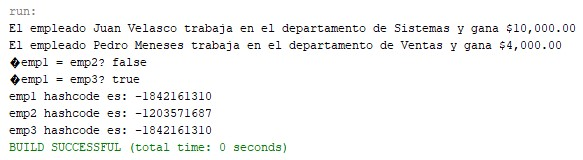
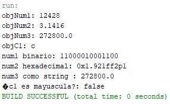

# Java Employees and Wrapper Classes

A Java project containing two exercises focused on fundamental object-oriented programming concepts and Java wrapper classes.

The first exercise demonstrates the creation and comparison of custom objects using the `equals()`, `hashCode()`, and `toString()` methods. The second exercise demonstrates the use of Java wrapper classes, including boxing, autoboxing, and numeric value conversions.

---

## Overview

This project contains two independent exercises organized into separate Java packages:

1. **Employee Exercise**
   - Object creation.
   - Encapsulation using private attributes.
   - Getters and setters.
   - Custom string representation using `toString()`.
   - Object comparison using `equals()`.
   - Hash code generation using `hashCode()`.

2. **Wrapper Classes Exercise**
   - Primitive data types.
   - Java wrapper classes.
   - Explicit boxing.
   - Autoboxing.
   - Numeric conversions.
   - Binary and hexadecimal representations.
   - Character validation.

---

# Project Structure

```text
java-employees-and-wrapper-classes/
│
├── README.md
│
├── assets/
│   └── images/
│       ├── employee_output.jpg
│       └── wrapper_output.jpg
│
└── src/
    ├── ejercicio1/
    │   ├── Empleado.java
    │   └── TestEmpleado.java
    │
    └── ejercicio2/
        └── TestWrappers.java
```

---

# Exercise 1: Employee Class

The first exercise implements an `Empleado` class representing an employee.

Each employee contains the following information:

- Name.
- Department.
- Salary.

The class also provides methods for accessing and modifying these attributes.

## Main Features

The `Empleado` class implements:

- `getNombre()`
- `setNombre()`
- `getDepartamento()`
- `setDepartamento()`
- `getSueldo()`
- `setSueldo()`
- `equals()`
- `hashCode()`
- `toString()`

---

## Object Comparison

The `equals()` method compares two employee objects.

Two employees are considered equal when they have the same:

- Name.
- Department.

Example:

```java
Empleado emp1 = new Empleado(
    "Juan Velasco",
    "Sistemas",
    10000
);

Empleado emp3 = new Empleado(
    "Juan Velasco",
    "Sistemas",
    10000
);

System.out.println(emp1.equals(emp3));
```

Expected result:

```text
true
```

---

## Hash Code Generation

The `hashCode()` method generates an integer value based on the employee's:

- Name.
- Department.
- Salary.

Example:

```java
System.out.println(emp1.hashCode());
```

Objects containing the same values can produce the same hash code.

---

## String Representation

The `toString()` method provides a human-readable representation of an employee.

Example output:

```text
El empleado Juan Velasco trabaja en el departamento de Sistemas y gana $10,000.00
```

The salary is formatted using:

```java
NumberFormat.getCurrencyInstance()
```

---

# Employee Exercise Output

The following image shows the execution of the employee exercise.



The program creates multiple employee objects and compares them using the `equals()` method.

It also displays the hash code generated for each employee.

---

# Exercise 2: Wrapper Classes

The second exercise demonstrates the use of Java wrapper classes.

The program works with the following primitive types:

```java
int
float
double
char
```

Their corresponding wrapper classes are:

```text
int       → Integer
float     → Float
double    → Double
char      → Character
```

---

## Boxing

Boxing converts a primitive value into its corresponding wrapper object.

Example:

```java
int num1 = 12428;

Integer objNum1 = new Integer(num1);
```

The primitive `int` value is stored inside an `Integer` object.

The exercise also demonstrates boxing for:

```java
Float
Double
Character
```

---

## Autoboxing

Java can automatically convert primitive values into wrapper objects.

Example:

```java
objC1 = c1;
```

In this case, the primitive value:

```java
char
```

is automatically converted into a:

```java
Character
```

object.

---

## Numeric Conversions

The program demonstrates several conversions.

### Integer to Binary

```java
Integer.toBinaryString(num1)
```

Example:

```text
num1 binario: 11000010001100
```

---

### Float to Hexadecimal Representation

```java
Float.toHexString(num2)
```

Example:

```text
num2 hexadecimal: 0x1.921ffep1
```

---

### Double to String

```java
Double.toString(num3)
```

Example:

```text
num3 como string : 272800.0
```

---

## Character Validation

The program checks whether a character is uppercase using:

```java
Character.isUpperCase(c1)
```

Example:

```java
char c1 = 'c';

System.out.println(
    Character.isUpperCase(c1)
);
```

Expected result:

```text
false
```

because the character `c` is lowercase.

---

# Wrapper Classes Exercise Output

The following image shows the execution of the wrapper classes exercise.



The output displays the wrapper objects, numeric conversions, and character validation.

---

# How to Run

## Using NetBeans

1. Open NetBeans.
2. Open the Java project.
3. Navigate to the desired package.
4. Select the test class to execute.

For the employee exercise:

```text
ejercicio1/TestEmpleado.java
```

For the wrapper classes exercise:

```text
ejercicio2/TestWrappers.java
```

5. Right-click the class.
6. Select:

```text
Run File
```

---

# Technologies Used

- Java
- Java Standard Library
- `NumberFormat`
- Wrapper Classes
- Object-Oriented Programming

---

# Concepts Demonstrated

This project demonstrates the following Java concepts:

- Classes and objects.
- Constructors.
- Encapsulation.
- Private attributes.
- Getters and setters.
- Method overriding.
- `equals()`.
- `hashCode()`.
- `toString()`.
- Object comparison.
- Primitive data types.
- Wrapper classes.
- Boxing.
- Autoboxing.
- Numeric conversions.
- Binary representation.
- Hexadecimal representation.
- Character validation.

---

# Example Employee Output

A typical execution may produce output similar to:

```text
El empleado Juan Velasco trabaja en el departamento de Sistemas y gana $10,000.00
El empleado Pedro Meneses trabaja en el departamento de Ventas y gana $4,000.00

¿emp1 = emp2? false

¿emp1 = emp3? true

emp1 hashcode es: ...
emp2 hashcode es: ...
emp3 hashcode es: ...
```

The exact hash code values may depend on the execution and Java implementation.

---

# Example Wrapper Classes Output

A typical execution may produce:

```text
objNum1: 12428
objNum2: 3.1416
objNum3: 272800.0
objC1: c

num1 binario: ...
num2 hexadecimal: ...
num3 como string : 272800.0

¿c1 es mayúscula?: false
```

The output demonstrates how primitive values can be stored in wrapper objects and converted into different representations.
